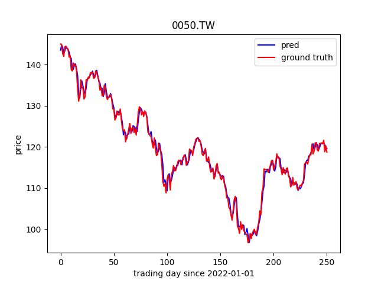
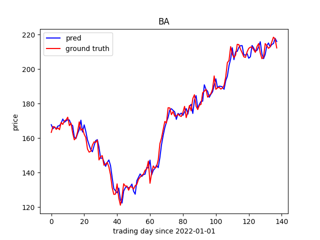

# Closing Price Prediction

## Introduction 
This is a simplified implementation of the research paper [1]. In this implementation, only the ANN were used and tested.

## Dataset
The dataset are

| |Training Dataset | Testing Dataset|
|-----|-------------|--------------|
|Time Interval | 01/01/2011 - 12/31/2021| 01/01/2022 - 02/17/2023|

Note that the first 13 days of both training set and testing set are dropped since there are no 14 days MA data.

The data is collected from yahoo finance by yfinance.

## Model 
A simple network architecture is listed below:
```
----------------------------------------------------------------
        Layer (type)               Output Shape         Param #
================================================================
            Linear-1                 [-1, 1024]          14,336
         LeakyReLU-2                 [-1, 1024]               0
            Linear-3                  [-1, 512]         524,800
         LeakyReLU-4                  [-1, 512]               0
            Linear-5                  [-1, 128]          65,664
         LeakyReLU-6                  [-1, 128]               0
            Linear-7                    [-1, 1]             129
================================================================
Total params: 604,929
Trainable params: 604,929
Non-trainable params: 0
----------------------------------------------------------------
Input size (MB): 0.00
Forward/backward pass size (MB): 0.03
Params size (MB): 2.31
Estimated Total Size (MB): 2.33
----------------------------------------------------------------
```

The 13 input features are:
* Variables mentioned in [1] (6 in total)
* OHLC of previous day (4 in total)
* 3 days MA
* Volume ratio(volume of previous day / rolling average volume from the first day)
* Open price of current day


## Results

### RMSE and MAPE
|Company or Index|RMSE|MAPE|
|------|-----|----|
|0050|1.11|0.71%|
|Nike|1.75|1.32%|
|Boeing|3.45|1.58%|
|Apple|2.73|1.46%|
|Amazon|2.87|1.92%|

It is by no means an outstanding result in my opinion, but the fact that the model does have the capability to caputure trend with such an simple network is quite suprising.

### 0050
<p align="center">
  
</p>

### Apple
<p align="center">
  
</p>

### Amazon
<p align="center">
  
</p>

### The Boeing Company 
<p align="center">
  
</p>

### Nike
<p align="center">
  
</p>

## DISCLAIMER:

The information provided by this code is for educational and informational purposes only. It is not intended to provide investment advice and should not be relied upon as such. The user of this code acknowledges that any investment involves a high degree of risk, including the risk of losing money. The code should not be used as a sole basis for investment decisions.

## Reference

[1] Mehar Vijh, Deeksha Chandola, Vinay Anandikkiwal, Arun Kumar, Stock Closing Price Prediction using Machine Learning Techniques, Procedia Computer Science,
Volume 167, 2020, Pages 599-606, ISSN 1877-0509, https://doi.org/10.1016/j.procs.2020.03.326.
