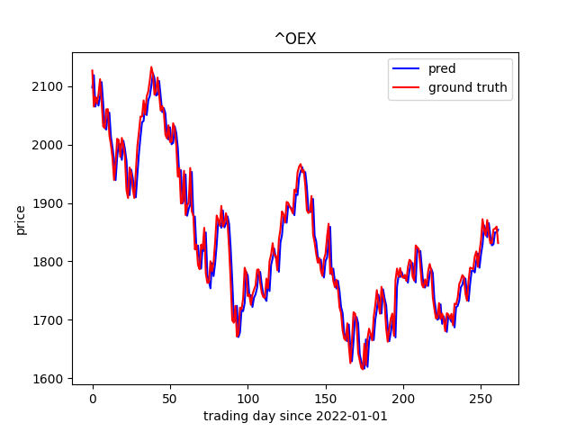

# Closing Price Prediction

## Introduction 
This is a simplified implementation of the research paper [1]. In this implementation, only the ANN were used and tested.

## Dataset
The dataset are

| |Training Dataset | Testing Dataset|
|-----|-------------|--------------|
|Time Interval | 01/01/2011 - 12/31/2021| 01/01/2022 - 02/17/2023|

note that the first 14 days of training set and testing set are dropped since there are no 14 days MA data.

The data source is collected from yahoo finance by yfinance.

## Model 
An simple network architecture is listed below:
```
----------------------------------------------------------------
        Layer (type)               Output Shape         Param #
================================================================
            Linear-1                 [-1, 1024]          12,288
              ReLU-2                 [-1, 1024]               0
            Linear-3                  [-1, 256]         262,400
              ReLU-4                  [-1, 256]               0
            Linear-5                   [-1, 32]           8,224
              ReLU-6                   [-1, 32]               0
            Linear-7                    [-1, 1]              33
================================================================
Total params: 282,945
Trainable params: 282,945
Non-trainable params: 0
----------------------------------------------------------------
Input size (MB): 0.00
Forward/backward pass size (MB): 0.02
Params size (MB): 1.08
Estimated Total Size (MB): 1.10
----------------------------------------------------------------

```

The 11 input features are:
* Variables mentioned in [1] (6 in total)
* OHLC of previos day (4 in total)
* 3 days MA


## Results

### RMSE and MAPE
|Company or Index|RMSE|MAPE|
|------|-----|----|
|S&P 500|0.84|1.19%|
|S&P 100|0.22|1.23%|
|0050|0.005|1.09%|
|Nike|0.01|1.93%|
|Boeing|0.23|2.12%|
|Apple|0.14|1.72%|
|Amazon|0.15|2.48%|


### S&P 500
<p align="center">
  
</p>

### S&P 100
<p align="center">
  
</p>

### 0050
<p align="center">
  
</p>

### Apple
<p align="center">
  
</p>

### Amazon
<p align="center">
  
</p>

### The Boeing Company 
<p align="center">
  
</p>

### Nike
<p align="center">
  
</p>


## Reference

[1] Mehar Vijh, Deeksha Chandola, Vinay Anandikkiwal, Arun Kumar, Stock Closing Price Prediction using Machine Learning Techniques, Procedia Computer Science,
Volume 167, 2020, Pages 599-606, ISSN 1877-0509, https://doi.org/10.1016/j.procs.2020.03.326.